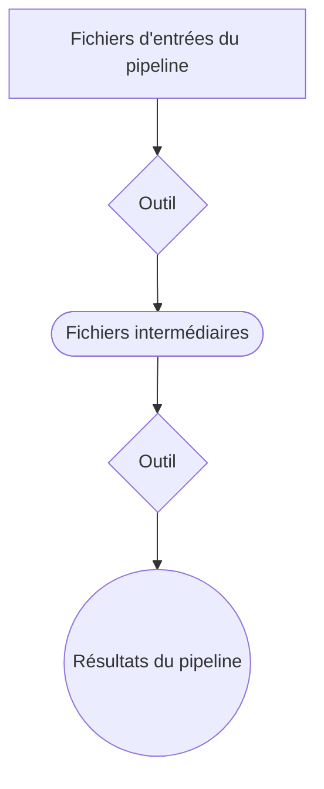

# MODÈLE DE DÉPÔT

[](README_FR.md)
[](https://github.com/AAFC-Bioinfo-AAC/template-repository)

[](https://opensource.org/licenses/MIT)
[](https://docs.github.com/en/repositories/creating-and-managing-repositories/creating-a-template-repository)

## À propos

*Fournissez un résumé, l'objectif et les principales caractéristiques du projet.*

*Exemple **À propos** :*

Ce dépôt sert de modèle pour créer des flux de travail reproductibles et personnalisables pour le traitement des données. Il est conçu pour aider les chercheurs et développeurs à démarrer rapidement de nouveaux projets en fournissant des composants modulaires et paramétrables qui peuvent être facilement adaptés à différents cas d'utilisation. Le modèle peut être personnalisé, en ajoutant ou retirant des sections au besoin, tout en maintenant une bonne documentation.

Pour plus d'informations, consultez : [Guide d'utilisation du dépôt modèle](https://github.com/AAFC-Bioinfo-AAC/quick-start-guide/blob/main/docs/template-repo-user-guide.md)

---

## Table des matières

*Exemple **Table des matières** (peut aussi être placée avant la section **À propos**) :*

- [MODÈLE DE DÉPÔT](#modèle-de-dépôt)
  - [À propos](#à-propos)
  - [Table des matières](#table-des-matières)
  - [Aperçu](#aperçu)
  - [Données](#données)
  - [Paramètres](#paramètres)
  - [Utilisation](#utilisation)
    - [Prérequis](#prérequis)
    - [Instructions d'installation](#instructions-dinstallation)
    - [Notes](#notes)
  - [Sortie](#sortie)
  - [Crédits](#crédits)
  - [Contribution](#contribution)
  - [Licence](#licence)
  - [Références](#références)
    - [Publications](#publications)
    - [Ressources](#ressources)
    - [Outils/Logiciels](#outilslogiciels)
  - [Citation](#citation)

---

## Aperçu

*Fournissez un résumé général du processus avec un diagramme de flux optionnel.*

*Exemple **Aperçu** :*

Ce projet implémente un pipeline générique pour l'importation, le traitement et l'analyse des données. Il peut être personnalisé pour convenir à différents types de flux de travail.

*Exemple de diagramme de flux de travail :*



---

## Données

*Fournissez des informations sur les formats, la structure et les sources des données d'entrée.*

*Exemple de **Données** :*

- **Jeu de données 1** : Séquences FASTQ récupérées de NCBI le 2025-01-01.
- **Jeu de données 2** : Génome de référence au format FASTA d'Ensembl, téléchargé le 2025-01-01.

Pour télécharger les données :

```bash
curl -O https://example.com/chemin/vers/jeu_de_donnees1.tar.gz
```

---

## Paramètres

*Fournissez des détails ou un tableau des options de configuration et leurs descriptions.*

*Exemple de Paramètres:*

| Paramètre          | Description                                        |
|--------------------|----------------------------------------------------|
| `dossier_entree`     | Chemin vers le dossier de données d'entrée.        |
| `dossier_sortie`    | Chemin vers le dossier où écrire les résultats.    |
| `activer_journal`   | Journaliser les étapes d'exécution (`true` ou `false`).|

---

## Utilisation

*Fournissez des informations sur les prérequis, les instructions d'installation, de configuration et d'exécution du pipeline, ainsi que des notes si nécessaire.*

*Exemple Utilisation:*

### Prérequis

- Conda
- Python 3.9+
- Système d'exploitation recommandé: Linux

### Instructions d'installation

1. Cloner le dépôt :

   ```bash
   git clone https://github.com/your-org/your-repo.git
   cd your-repo
   ```

2. Créer l'environnement Conda

   ```bash
    conda env create -f your-repo/config/environment.yml
    conda activate conda_env
   ```

3. Configurer les paramètres du pipeline :
   Modifiez le fichier `config.yaml` pour spécifier les chemins vers vos données d'entrée et les paramètres désirés si votre pipeline en utilise un.

4. Exécuter le pipeline :

   ```bash
   python script.py --input input_folder fastq_files --output_folder results
   ```

### Notes

- Assurez-vous d'avoir suffisamment d'espace disque pour les fichiers temporaires et de sortie.

---

## Sortie

*Fournissez le format, l'emplacement et le nom des fichiers de résultats, ainsi qu'une brève description.*

*Exemple de Sorties:*

Les fichiers de sortie incluent :

- `results/reports/summary.csv` : Principales mesures issues de l'analyse.
- `results/logs/pipeline.log` : Journal étape par étape.
- `results/plots/visualization.png` : Graphique de sortie.

---

## Crédits

*Fournissez des remerciements aux contributeurs et collaborateurs. Indiquez un contact principal, généralement l'administrateur/gestionnaire du dépôt.*

Développé et maintenu par l'**Équipe ABCC**.

Les fichiers suivants ont été adaptés du [Gabarit pour dépôts de code source ouvert du gouvernement du Canada](https://github.com/canada-ca/template-gabarit) :

- CODE_OF_CONDUCT.md
- CONTRIBUTING.md
- SECURITY.md

Ce projet inclut du contenu généré par des modèles d'IA, qui a été révisé et vérifié pour l'exactitude par l'équipe du projet.

*Exemple Crédits:*

Les contributeurs incluent :

- Contributeur 1
- Contributeur 2

**Contact principal :** [Nom]

---

## Contribution

*Fournissez des lignes directrices pour contribuer au projet.*

Si vous souhaitez contribuer à ce projet, veuillez consulter les lignes directrices dans [CONTRIBUTING.md](CONTRIBUTING.md) et vous assurer de respecter notre [CODE_OF_CONDUCT.md](CODE_OF_CONDUCT.md) afin de favoriser un environnement respectueux et inclusif.

---

## Licence

*Fournissez les informations sur la licence, en modifiant la licence MIT par défaut si nécessaire. Ajoutez la déclaration de droit d'auteur dans la licence.*

Ce projet est distribué sous la licence MIT. Pour tous les détails et les informations sur le droit d'auteur, consultez le fichier [LICENSE](LICENSE).

---

## Références

*Fournissez des références aux publications clés et toutes ressources utiles pour les outils/logiciels utilisés. Les citations formelles des outils utilisés peuvent également être fournies par un fichier CITATIONS.md.*

*Exemple Références:*

### Publications

Le pipeline et l'analyse qui y est associée sont publiés ici :

- Titre de votre article publié – Revue, Année.

### Ressources

- Lien vers le manuel Snakemake
- Lien vers la documentation de l'outil X
  
### Outils/Logiciels

Les références aux outils et logiciels utilisés ici se trouvent dans le fichier [CITATIONS.md](CITATIONS.md).

---

## Citation

*Fournissez des informations sur la façon de citer ce dépôt. Utilisez un fichier CITATION.cff si nécessaire. Les outils de citation comme GitHub et Zenodo utiliseront ce fichier pour générer des références normalisées.*

Si vous utilisez ce projet dans vos travaux, veuillez le citer en utilisant le fichier [CITATION.cff](CITATION.cff).
