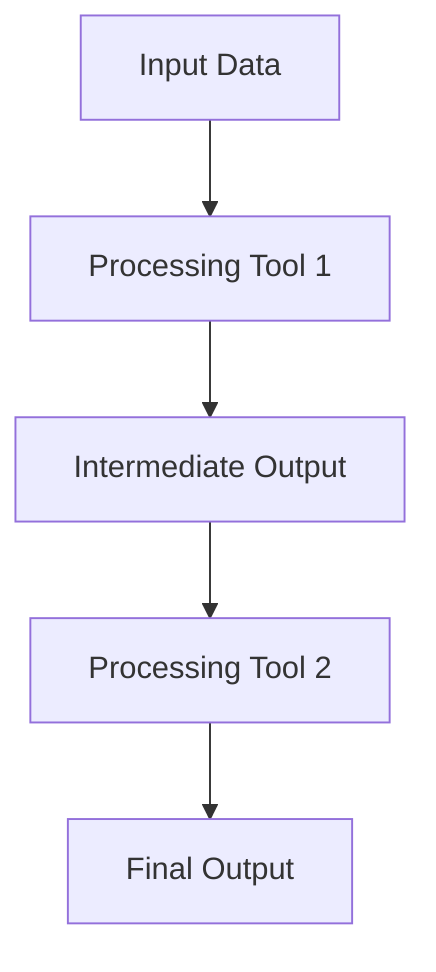

# TEMPLATE REPOSITORY

[](https://opensource.org/licenses/MIT)
[](https://docs.github.com/en/repositories/creating-and-managing-repositories/creating-a-template-repository)
<sub>🔎 Click the badges above to learn more.</sub>


*Using GitHub badges is a great way to display project metadata, build status, license, dependencies, versioning, and more — directly in your README.md. Each badge links to relevant documentation or license details. These badges above were created using [Shields.io](https://shields.io/). For example, the MIT license badge was created using:*
```
[](https://opensource.org/licenses/MIT)
```

## About

*Provide a summary, purpose, and key features of the project.*

This repository serves as a template for creating reproducible and customizable data processing workflows. It is designed to help researchers and developers quickly set up new projects by providing modular and parameterized components that can be easily adapted to different use cases.

Features:
- Flexible configuration options for diverse datasets and pipelines.
- Clear structure for reproducibility and collaboration.
- Built-in support for extensibility and integration with external tools.

---

## Table of Contents

*The Table of Contents (TOC) may be autogenerated, for example, using VSCode extension [Markdown All in One](
https://marketplace.visualstudio.com/items?itemName=yzhang.markdown-all-in-one#table-of-contents). The TOC may optionally be placed above the **About** section.*

- [TEMPLATE REPOSITORY](#template-repository)
  - [About](#about)
  - [Table of Contents](#table-of-contents)
  - [Overview](#overview)
  - [Data](#data)
  - [Parameters](#parameters)
  - [Usage](#usage)
    - [Pre-requisites](#pre-requisites)
    - [Setup Instructions](#setup-instructions)
    - [Notes](#notes)
  - [Output](#output)
  - [Credits](#credits)
  - [Contribution](#contribution)
  - [Copyright](#copyright)
  - [License](#license)
  - [References](#references)
    - [Publications](#publications)
    - [Resources](#resources)
    - [Tools/Software](#toolssoftware)
  - [Citation](#citation)

---

## Overview

*Provide a high-level process summary with an optional pipeline diagram.*                                       

This project implements a generic pipeline for data ingestion, processing, and analysis. It can be customized to suit different types of workflows.

**Example Workflow Diagram:**



---

## Data

*Provide information on input data formats, structure, and sources.*

Example data used:

- **Dataset 1**: FASTQ reads retrieved from NCBI on 2025-01-01.
- **Dataset 2**: Reference genome in FASTA format from Ensembl, downloaded on 2025-01-01.

To download the data:

```bash
curl -O https://example.com/path/to/dataset1.tar.gz
```

---

## Parameters

*Provide details or a table of configuration options and their descriptions.*

| Parameter          | Description                                        |
|--------------------|----------------------------------------------------|
| `input_folder`     | Path to the input data folder.                     |
| `output_folder`    | Path to folder to write results into.                |
| `enable_logging`   | Whether to log execution steps (`true` or `false`).|

---

## Usage

*Provide information on any pre-requisites, instructions on installation, configuration, and execution of the pipeline, and notes if any.*

### Pre-requisites

- Conda 
- Python 3.9+
- Recommended OS: Linux

### Setup Instructions

1. Clone the repository:
   ```bash
   git clone https://github.com/your-org/your-repo.git
   cd your-repo
   ```

2. Create the Conda environment
```
conda env create -f your-repo/config/environment.yml
conda activate conda_env
```

3. Configure pipeline parameters:
   Edit the `config.yaml` file to specify paths to your input data and desired settings if your pipeline uses one.

4. Execute the pipeline:
   ```bash
   python script.py --input input_folder fastq_files --output_folder results
   ```

### Notes

- Ensure sufficient disk space for temporary and output files.

---

## Output

*Provide format, location, and naming of result files, and a brief description.*

Example output files include:

- `results/reports/summary.csv`: Key metrics from analysis.
- `results/logs/pipeline.log`: Step-by-step log.
- `results/plots/visualization.png`: Output plot.

---

## Credits

*Provide acknowledgements to contributors and collaborators. Indicate a primary contact, typically the admin/maintainer of the repository.*

Developed and maintained by the ABCC team.

Contributors:
- Contributor 1
- Contributor 2

Primary contact: [Name](mailto: <email_id>)

---

## Contribution

*Point to guidelines for contributing to the project.*

If you would like to contribute to this project, please review the guidelines in [CONTRIBUTING.md](CONTRIBUTING.md) and ensure you adhere to our [CODE_OF_CONDUCT.md](CODE_OF_CONDUCT.md) to foster a respectful and inclusive environment.

---

## Copyright

*Provide ownership and intellectual property details.*

Government of Canada, Agriculture & Agri-Food Canada (AAFC).

---

## License

*Provide license information, changing from the default MIT included where required.*

This project is licensed under the MIT License. See [LICENSE](LICENSE) for full details.

The MIT License was chosen to promote openness and reproducibility, allowing others to freely use, modify, and distribute the project while ensuring proper attribution.

---

## References

*Provide references to key publications and any useful resources for tools/software used. Formal citations of the tools used may also be provided via a CITATIONS.md file.*


### Publications
The pipeline and analysis associated with it is published here:
- Your published paper title – Journal, Year.

### Resources
- Link to Snakemake Manual
- Link to Tool X Documentation
  
### Tools/Software
References to tools and software used here can be found in the [CITATIONS.md](CITATIONS.md) file.

---

## Citation

*Provide information on how to cite this repository. Use a CITATION.cff file where required. Citation tools like GitHub and Zenodo will use this file to generate standardized references.*

If you use this project in your work, please cite it using the [CITATION.cff](CITATION.cff) file.
