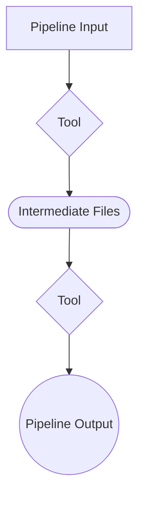

<!-- omit in toc -->
# USER GUIDE

*Feel free to adjust this template to suit your needs, while ensuring that all information necessary for reproducibility is included.*

<!-- omit in toc -->
## Table of Contents

*Example **Table of Contents**:*

- [Overview](#overview)
- [Data](#data)
- [Parameters](#parameters)
- [Usage](#usage)
  - [Pre-requisites](#pre-requisites)
  - [Setup Instructions](#setup-instructions)
  - [Notes](#notes)
- [Output](#output)

---

## Overview

*Provide a high-level process summary with an optional workflow diagram.*

*Example **Overview**:*

This project implements a generic pipeline for data ingestion, processing, and analysis. It can be customized to suit different types of workflows.

*Example Workflow Diagram:*



---

## Data

*Provide information on input data formats, structure, and sources.*

*Example Data:*

- **Dataset 1**: FASTQ reads retrieved from NCBI on 2025-01-01.
- **Dataset 2**: Reference genome in FASTA format from Ensembl, downloaded on 2025-01-01.

To download the data:

```bash
curl -O https://example.com/path/to/dataset1.tar.gz
```

---

## Parameters

*Provide details or a table of configuration options and their descriptions.*

*Example Parameters:*

| Parameter          | Description                                        |
|--------------------|----------------------------------------------------|
| `input_folder`     | Path to the input data folder.                     |
| `output_folder`    | Path to folder to write results into.                |
| `enable_logging`   | Whether to log execution steps (`true` or `false`).|

---

## Usage

*Provide information on any pre-requisites, instructions on installation, configuration, and execution of the pipeline, and notes if any.*

*Example Usage:*

### Pre-requisites

- Conda
- Python 3.9+
- Recommended OS: Linux

### Setup Instructions

1. Clone the repository:

   ```bash
   git clone https://github.com/your-org/your-repo.git
   cd your-repo
   ```

2. Create the Conda environment

   ```bash
   conda env create -f your-repo/config/environment.yml
   conda activate conda_env
    ```

3. Configure pipeline parameters:
   Edit the `config.yaml` file to specify paths to your input data and desired settings if your pipeline uses one.

4. Execute the pipeline:

   ```bash
   python script.py --input input_folder fastq_files --output_folder results
   ```

### Notes

- Ensure sufficient disk space for temporary and output files.

---

## Output

*Provide format, location, and naming of result files, and a brief description.*

*Example Output:*

Output files include:

- `results/reports/summary.csv`: Key metrics from analysis.
- `results/logs/pipeline.log`: Step-by-step log.
- `results/plots/visualization.png`: Output plot.

---
